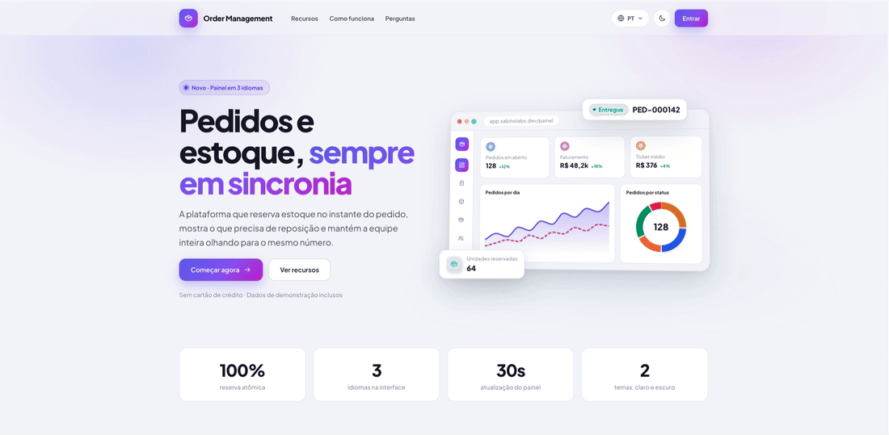
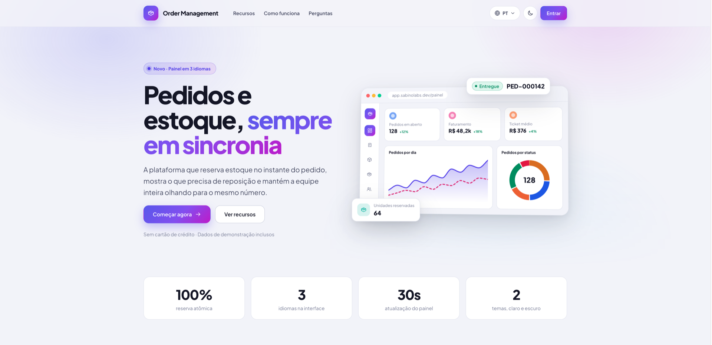
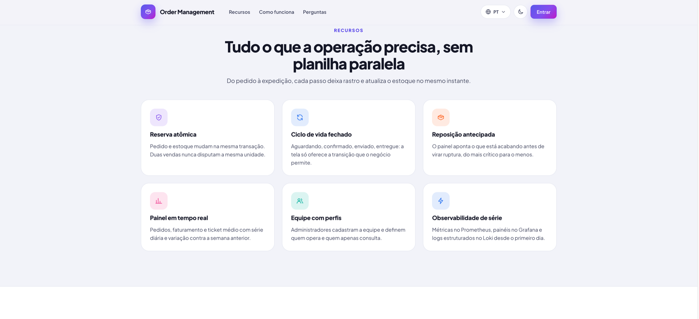
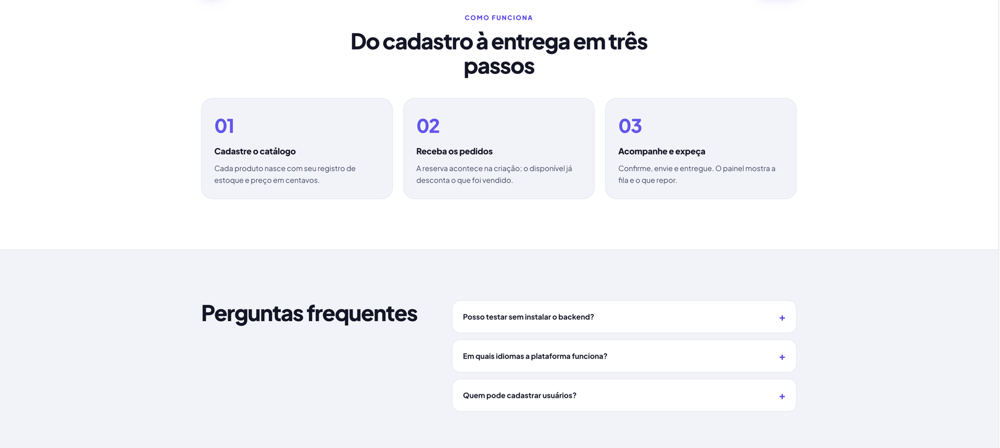
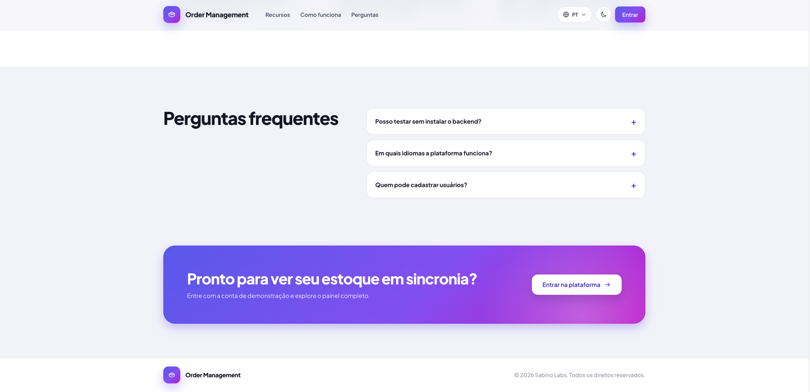
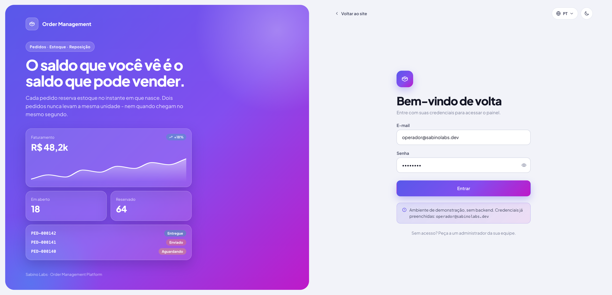
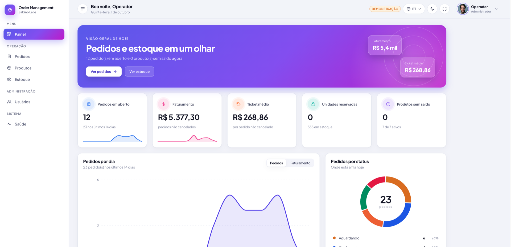
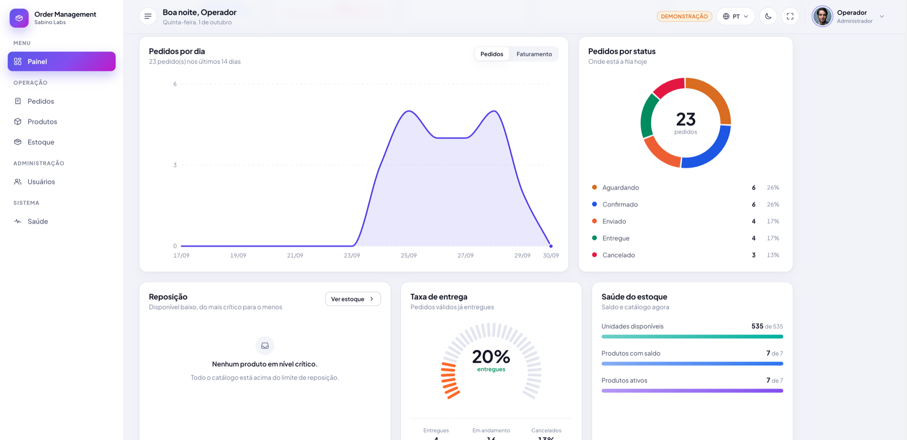
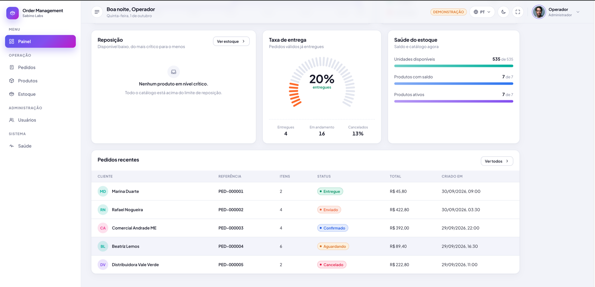
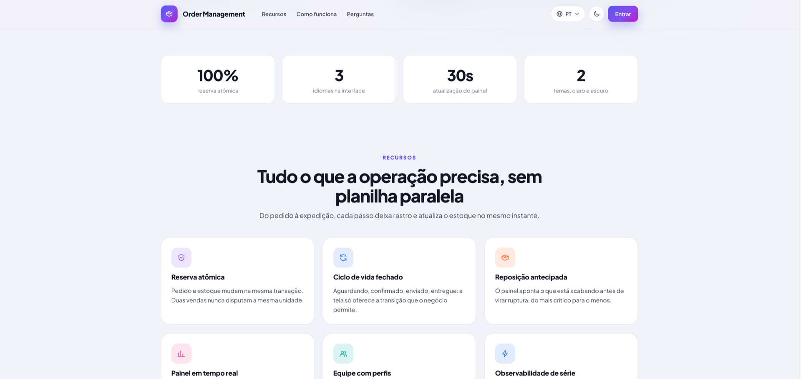

# order-management-platform

Plataforma de gestao de pedidos e estoque: catalogo de produtos, controle de
saldo com reserva, e o ciclo de vida completo do pedido. API em FastAPI com
DDD e arquitetura hexagonal, frontend em React, implantacao em Kubernetes.
Site e painel em portugues, ingles e espanhol, nos temas claro e escuro.

<p align="center">
  
</p>

<p align="center">
  <a href="#a-historia">A historia</a> ·
  <a href="#galeria">Galeria</a> ·
  <a href="#comecando">Comecando</a> ·
  <a href="#api">API</a> ·
  <a href="#estrutura">Estrutura</a>
</p>

## A historia

### A prensa que foi vendida duas vezes

Toda terca, a Distribuidora Vale Verde fecha a semana de pedidos de cafe,
cha e acessorios. Marina Duarte cuida da operacao - e, ate pouco tempo, cuidava
dela numa planilha.

Numa dessas tercas chegaram dois pedidos quase no mesmo segundo, um do
Comercial Andrade e outro da Beatriz Lemos. Os dois levaram a ultima prensa
francesa de 600ml. A planilha mostrava uma unidade disponivel para cada um,
porque ninguem tinha atualizado a linha entre uma venda e outra. A Beatriz
recebeu um pedido de desculpas no lugar da prensa.

O problema nao era a planilha. O numero que a equipe via nao era o numero que
dava para vender.

### O site

Procurando uma saida, Marina caiu numa frase que descrevia exatamente o
problema dela: *pedidos e estoque, sempre em sincronia*.



Logo abaixo vinham os recursos. O primeiro era o que ela precisava ler:
**reserva atomica** - pedido e estoque mudam na mesma transacao, e duas vendas
nunca disputam a mesma unidade.



O resto da operacao estava descrito em tres passos: cadastrar o catalogo,
receber os pedidos e acompanhar ate a entrega.



Ela ainda tinha duvidas. Precisava instalar alguma coisa para testar? Nao: o
modo de demonstracao sobe tudo com dados de exemplo. A equipe tem gente que
fala espanhol? O site e o painel trocam de idioma em um clique. Bastava
entrar.



### A entrada

A tela de login resume a promessa em uma linha: *o saldo que voce ve e o saldo
que pode vender*. No modo de demonstracao as credenciais ja vem preenchidas -
um clique e se esta dentro.



### A primeira manha no painel

O painel abre com um resumo do dia: quantos pedidos estao em aberto e quantos
produtos estao sem saldo. Logo abaixo ficam os cinco numeros que Marina antes
calculava a mao: pedidos em aberto, faturamento, ticket medio, unidades
reservadas e produtos sem saldo.



A serie dos ultimos 14 dias mostra o ritmo da semana, alternando entre pedidos
e faturamento. A rosca ao lado responde onde a fila esta parada hoje: quantos
pedidos aguardam, quantos ja foram confirmados, enviados, entregues ou
cancelados.



Mais embaixo ficam as perguntas de todo fim de tarde. Tem algo para repor? A
lista de reposicao aponta do mais critico para o menos. Quanto da fila ja foi
entregue? E os pedidos mais recentes estao na tabela, a um clique do detalhe.



### O que mudou

Na terca seguinte chegaram de novo dois pedidos ao mesmo tempo para o ultimo
moedor manual. O primeiro reservou a unidade no instante em que foi criado. O
segundo recebeu uma resposta clara - estoque insuficiente, com quanto foi
pedido e quanto havia - antes de qualquer promessa ao cliente.

Ninguem pediu desculpas para ninguem.

Marina cadastrou o restante da equipe pela tela de **Usuarios**: um operador
para os pedidos e um acesso de leitura para o financeiro. Cada um entra com o
proprio perfil, no idioma que preferir, no tema claro ou escuro.

> Os nomes, pedidos e numeros desta historia sao os dados de demonstracao que
> acompanham o projeto (`make dev-frontend`). A foto do usuario de exemplo e do
> [Unsplash](https://unsplash.com/license).

## Galeria

| | |
| :---: | :---: |
| [](docs/screenshots/01-site-hero.png)<br>**Site** · hero e previa do painel | [](docs/screenshots/02-site-numeros.png)<br>**Site** · numeros e recursos |
| [](docs/screenshots/04-site-como-funciona.png)<br>**Site** · como funciona e perguntas | [](docs/screenshots/05-site-chamada-final.png)<br>**Site** · chamada final |
| [](docs/screenshots/06-login.png)<br>**Login** | [](docs/screenshots/07-painel-visao-geral.png)<br>**Painel** · visao geral |
| [](docs/screenshots/08-painel-graficos.png)<br>**Painel** · series e status | [](docs/screenshots/09-painel-operacao.png)<br>**Painel** · reposicao e pedidos recentes |

## O que a plataforma faz

O nucleo do sistema e a relacao entre **pedido** e **estoque**:

| Acao no pedido      | Efeito no estoque                                  |
| ------------------- | -------------------------------------------------- |
| Criar               | **reserva** o saldo de cada item                    |
| Alterar os itens    | devolve a reserva antiga e reserva a nova           |
| Cancelar            | **libera** o que estava reservado                   |
| Enviar              | **baixa** definitivamente o que estava reservado    |

O saldo e mantido em duas parcelas: o que existe fisicamente (`em maos`) e o
que ja foi prometido a pedidos (`reservado`). O que pode ser vendido e a
diferenca entre os dois - e o que impede dois pedidos simultaneos de venderem
a mesma unidade.

A maquina de estados do pedido e explicita e fechada:

```
pending ──▶ confirmed ──▶ shipped ──▶ delivered
   │            │
   └──▶ cancelled ◀┘
```

Qualquer transicao fora desse mapa e recusada com HTTP 409 e a lista das
transicoes possiveis no corpo da resposta.

Em volta desse nucleo:

- **Site publico** em `/`, com o painel em `/painel` atras do login.
- **Tres idiomas** - portugues do Brasil, ingles e espanhol - no site e em
  todo o painel, incluindo datas, numeros e moeda. A escolha fica salva no
  navegador; na primeira visita vale o idioma do sistema.
- **Tema claro e escuro**, sem piscar no carregamento.
- **Usuarios com perfil** (`admin`, `operator`, `viewer`). So administradores
  cadastram a equipe; nao existe cadastro publico.

## Comecando

```bash
make bootstrap    # dependencias (uv + pnpm) e .env
make dev          # backend + frontend juntos, com Postgres no Docker
make seed         # popula o banco com catalogo e pedidos de demonstracao
```

| Servico    | URL                                     |
| ---------- | --------------------------------------- |
| Frontend   | http://localhost:5173                   |
| API        | http://localhost:8000                   |
| Docs (API) | http://localhost:8000/docs              |

Credenciais de demonstracao: `operador@sabinolabs.dev` / `demo1234`. Esse
operador vem da configuracao e e o administrador raiz: e por ele que se
cadastra o restante da equipe.

### Backend e frontend separados

```bash
make dev-backend    # Postgres + migrations + API com reload
make dev-frontend   # frontend sozinho, com dados de demonstracao
make up             # tudo em containers (inclui Prometheus, Grafana e Loki)
make minikube-up    # tudo em um Kubernetes local
```

`make help` lista todos os alvos.

### Modo de demonstracao

Uma flag no `.env` decide se o frontend sobe com dados falsos ou fala com a
API de verdade:

```bash
VITE_USE_MOCKS=true    # sobe inteiro sem backend, desde a tela de login
VITE_USE_MOCKS=false   # consome a API
```

Com a flag ligada, o MSW intercepta na camada de rede: o codigo da aplicacao
faz `fetch` normalmente e nao sabe que esta mocado. O login ja vem preenchido,
as telas ficam marcadas com um selo *dados de demonstracao* e nenhuma rota de
API escapa para a rede - sem backend do outro lado, isso so viraria um erro de
conexao sem explicacao. No build de producao com a flag desligada, o pacote do
MSW nem entra no bundle.

Os alvos do `make` forcam o modo certo: `make dev-frontend` liga os mocks,
`make dev` e `make frontend` desligam (ha uma API de verdade rodando ao lado).

## API

```
POST   /api/v1/auth/login                    autentica o operador
GET    /api/v1/auth/me                       usuario da sessao

GET    /api/v1/users                         lista os usuarios (so admin)
POST   /api/v1/users                         cadastra usuario (so admin)

GET    /api/v1/dashboard                     visao consolidada

GET    /api/v1/products                      lista o catalogo (busca, paginacao)
POST   /api/v1/products                      cadastra produto (e o estoque dele)
GET    /api/v1/products/{id}                 detalha
PATCH  /api/v1/products/{id}                 altera parcialmente
DELETE /api/v1/products/{id}                 exclui (recusa se houver reserva)

GET    /api/v1/stock                         saldos
GET    /api/v1/stock/{product_id}            saldo de um produto
POST   /api/v1/stock/{product_id}/receipts   entrada de mercadoria
POST   /api/v1/stock/{product_id}/adjustments ajuste de inventario

GET    /api/v1/orders                        lista (filtro por status e busca)
POST   /api/v1/orders                        cria e reserva estoque
GET    /api/v1/orders/{id}                   detalha
PATCH  /api/v1/orders/{id}                   altera pedido pendente
POST   /api/v1/orders/{id}/confirm           confirma
POST   /api/v1/orders/{id}/ship              envia (baixa o estoque)
POST   /api/v1/orders/{id}/deliver           conclui
POST   /api/v1/orders/{id}/cancel            cancela (libera o estoque)
DELETE /api/v1/orders/{id}                   exclui pedido cancelado

GET    /health/live                          liveness probe
GET    /health/ready                         readiness probe
GET    /metrics                              metricas Prometheus
```

Erros seguem o RFC 9457 (`application/problem+json`), com o campo `code` na
linguagem do negocio (`insufficient_stock`, `invalid_status_transition`,
`duplicate_sku`) e os dados necessarios para agir - por exemplo, quanto foi
pedido e quanto ha disponivel.

## Estrutura

```
apps/api/      API FastAPI (uv, Python 3.13)
  src/api/       endpoints, dependencias, middlewares, traducao de erros
  src/domain/    model, schema, repository, service - sem framework
  src/infra/     banco, logging, metricas, configuracao, repositorios
  src/security/  hashing de senha, JWT, dependencias de autenticacao
apps/web/      Frontend React 19 + TypeScript (pnpm, Vite)
  src/features/  uma pasta por feature (landing, auth, dashboard, users...)
  src/shared/    UI, graficos, i18n (pt-BR, en, es) e tema
packages/      Codigo compartilhado entre apps
infra/
  helm/          chart da aplicacao
  terraform/     modulos de infraestrutura
  minikube/      scripts do ambiente Kubernetes local
  observability/ Prometheus, alertas, Loki/Promtail, dashboards Grafana
docs/          Arquitetura e decisoes
```

Detalhes e o porque de cada decisao em [docs/architecture.md](docs/architecture.md).

## Qualidade

```bash
make check              # lint + tipos + testes, dos dois lados
make test-unit          # testes que nao precisam de banco
make test-integration   # sobe o Postgres e roda os testes de integracao
```

O backend roda com `mypy --strict` e `ruff` com regras de anotacao, seguranca
e complexidade. O linter tambem reforca a arquitetura: `domain/` nao pode
importar FastAPI, SQLAlchemy ou Starlette.
